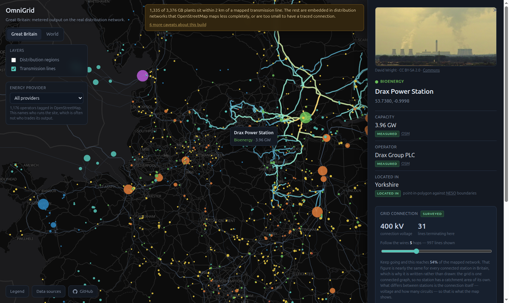

OmniGrid is an explorable map of where the world's electricity actually comes from, built entirely from open data.

🔌 **[Open the live map](https://d33ptar00p.github.io/omnigrid/)**



## What it does

- **145,396 power plants worldwide**, 22,636 GW of capacity, coloured by energy type and sized by capacity — every coal station, wind farm, solar park, reactor and dam that Global Energy Monitor tracks.
- **Great Britain in depth**: 3,376 surveyed plants, the 14 real distribution regions, 19,850 mapped power lines, and **half-hourly metered output** from Elexon — the volume each generating unit is actually settled on, not an estimate.
- **Trace the grid from a power station**: click one and the wires it is physically connected to light up, with its connection voltage and circuit count. Follow them further out with a slider.
- **Every figure shows its source.** Values are tagged *measured*, *derived* or *linked*, so an estimate never reads as a measurement, and a judgement we made never reads as a published fact.
- Filter by energy type, by operator (985 tagged in OpenStreetMap), and by project status.

## How to run locally

You need Python 3.12+, Node 20+ and [uv](https://github.com/astral-sh/uv).

```bash
# data pipeline
uv venv && uv pip install -e ".[geo,dev]"
.venv/bin/python -m pipeline.normalize

# web app
cd web && npm install && npm run dev
```

The pipeline fetches most sources automatically. One is not fetchable: Global Energy Monitor's tracker sits behind a name/email form, so download it once from [their site](https://globalenergymonitor.org/projects/global-integrated-power-tracker/download-data/) and drop the `.xlsx` into `data/raw/gem/`. Without it the World tab falls back to WRI's older database and says so on the map.

Run the tests with `.venv/bin/python -m pytest`.

## Where the data comes from

Nothing here is modelled. Every source is open, and each one is registered in `pipeline/sources/registry.yaml` with its licence and attribution, which is what generates the in-app *Data sources* panel.

| Source | What it provides |
|---|---|
| [Global Energy Monitor](https://globalenergymonitor.org/projects/global-integrated-power-tracker/) | 145,396 plants worldwide: capacity, fuel, status, owner, location |
| [Elexon BMRS](https://bmrs.elexon.co.uk/) | GB generating units, and B1610 settlement-grade metered output |
| [NESO](https://www.neso.energy/data-portal/gis-boundaries-gb-dno-license-areas) | The 14 GB distribution licence areas |
| [OpenStreetMap](https://www.openstreetmap.org/) | Plant locations, transmission lines, substations |
| [Wikidata & Wikimedia Commons](https://www.wikidata.org/) | Photographs of 169 GB stations, credited to their photographers |
| [Natural Earth](https://www.naturalearthdata.com/) | Country boundaries |

## A note on what the map can and cannot tell you

The obvious question to ask a map like this is *"which area does this power station supply?"* — and it has no answer. Electricity flows by physics, not by contract: nothing tags an electron with its destination, and if you and your neighbour buy from different suppliers the same electrons reach you both.

What *is* real is the wiring, and the map shows that instead. Click a station and you see the circuits that terminate there, at what voltage, and how far they run. Drax is wired to 54% of every mapped line in Britain — and so, near enough, is everything else connected to the transmission system. That is precisely why no station has a catchment area of its own.

Two things that *are* published, and are shown as such: Elexon states which distribution region each **embedded** generator feeds, and NESO publishes where those regions are. Transmission-connected stations have no region, because they feed the national grid.

An earlier version of this project modelled supply areas using optimal transport. It worked, and it was removed: a modelled boundary looks exactly like a real one, and nobody reading a map can tell the difference.

## Known limitations

- Matching an OpenStreetMap plant to an Elexon unit is our judgement, not a published identifier. It is deliberately conservative and labelled *record link* in the app.
- A few grid connections are still wrong. An 80 MW solar farm reads as 400 kV because a supergrid circuit happens to terminate nearby. Filtering those by plausibility would be inference, so they are left visible.
- Elexon declares no fuel type for 25 of the 31 GW of embedded capacity, so regions are shaded by capacity rather than fuel.
- OpenStreetMap maps distribution networks far less completely than transmission, so small generators often have no traceable connection.

## Licence

The code is [MIT](LICENSE). The data is not ours to license — each dataset keeps its own terms, and OpenStreetMap's ODbL is share-alike. See [DATA_LICENCES.md](DATA_LICENCES.md) before redistributing the built data.

## Contact

Found something wrong on the map? Open an issue — errors in the underlying data are interesting in their own right, and several of the fixes in this repository started as exactly that.
